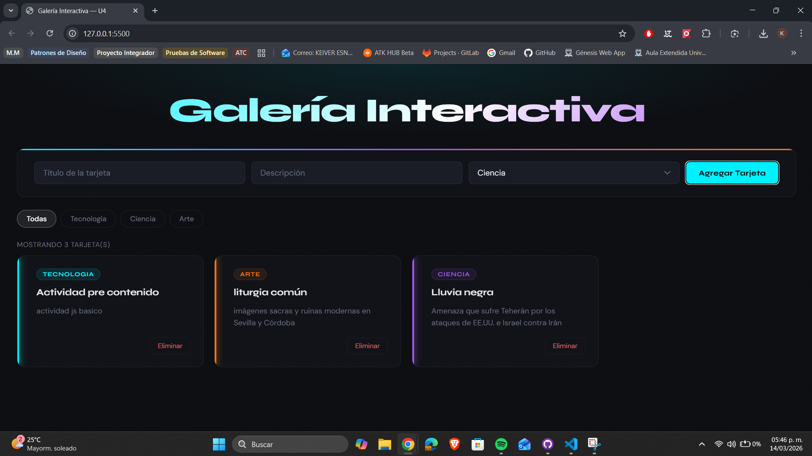
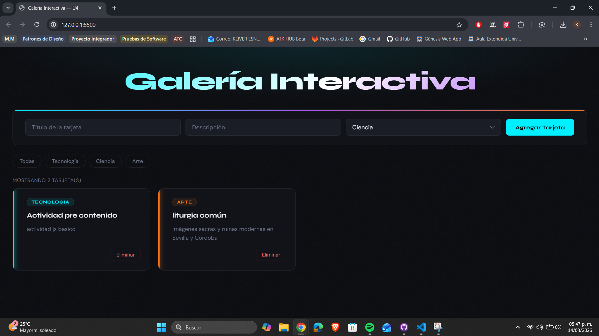
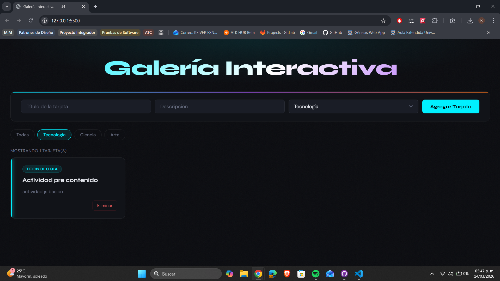
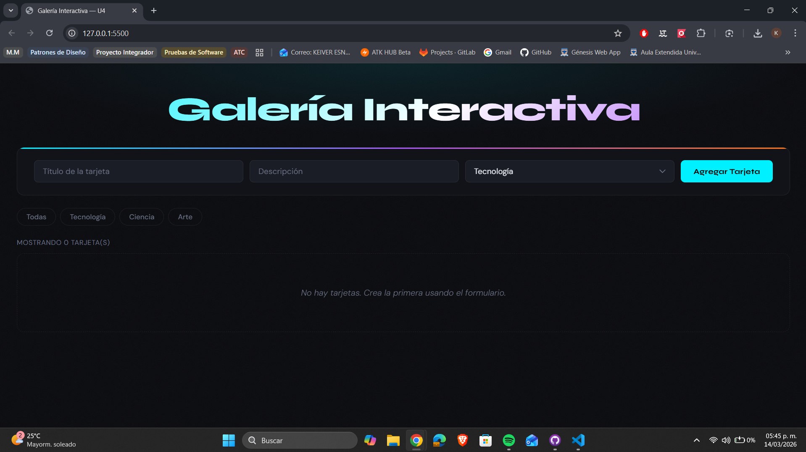

# castellanos-post1-u4

**Autor:** Keiver Esneid Castellanos Julio  
**Curso:** Programación Web — Unidad 4: JavaScript Básico  
**Programa:** Ingeniería de Sistemas  
**Universidad de Santander (UDES) · 2026**

---

## Descripción

Galería interactiva de tarjetas construida con JavaScript puro, sin librerías
externas. La aplicación permite crear, filtrar y eliminar tarjetas dinámicamente
en respuesta a las interacciones del usuario, aplicando manipulación del DOM,
delegación de eventos y características modernas de ES6.

---

## Tecnologías utilizadas

- HTML5
- CSS3
- JavaScript ES6 (vanilla, sin frameworks)

---

## Estructura del proyecto

```
castellanos-post1-u4/
├── index.html   → Estructura base de la galería
├── styles.css   → Estilos de la interfaz y tarjetas
└── app.js       → Lógica de la aplicación
```

---

## Instrucciones de ejecución

1. Clona el repositorio:

```bash
   git clone https://github.com/TU-USUARIO/castellanos-post1-u4.git
```

2. Abre la carpeta en **Visual Studio Code**.
3. Haz clic derecho sobre `index.html` y selecciona **Open with Live Server**.
4. La aplicación se abrirá automáticamente en Google Chrome.

---

## Funcionalidades implementadas

- ✅ **Checkpoint 1:** Formulario para agregar tarjetas con título, descripción y categoría
- ✅ **Checkpoint 2:** Eliminación de tarjetas con delegación de eventos
- ✅ **Checkpoint 3:** Filtros por categoría con resaltado del botón activo
- ✅ **Checkpoint 4:** Contador de tarjetas visibles y mensaje cuando la galería está vacía

---

## Conceptos de JavaScript aplicados

- Manipulación del DOM: `createElement`, `appendChild`, `remove`, `classList`
- Modelo de eventos: `addEventListener`, `event.target`, delegación de eventos
- ES6: arrow functions, template literals, desestructuración

---

## Capturas de pantalla

### Checkpoint 1 — Agregar tarjeta



### Checkpoint 2 — Eliminar tarjeta



### Checkpoint 3 — Filtrar por categoría



### Checkpoint 4 — Contador y galería vacía


